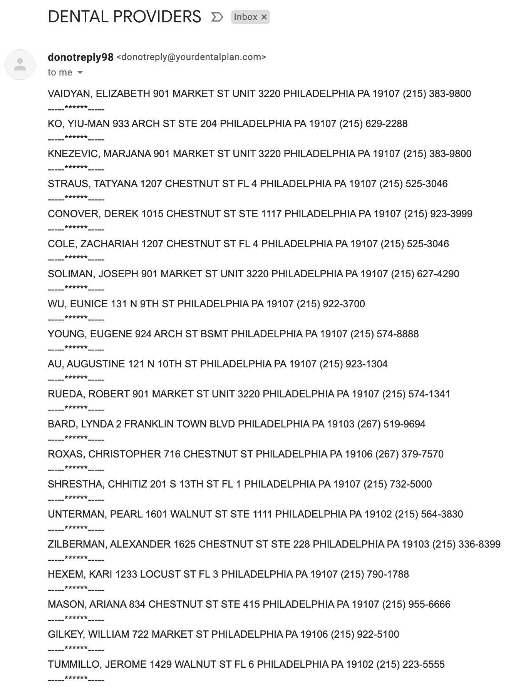

# UnitedHealthcare

This Python code creates a map from the messy 
email UnitedHealthcare sends out to patients 
regarding providers within their vicinity.

Here is what the email looks like:

And here is what the code creates:

# How Can I Use This?

  1. Open the _United_Healthcare_Dental.ipynb_ file 
      and click on the _Open in Colab_ button.

  2. Replace the list in the code with the list 
      emailed to you from UnitedHealthcare and replace 
      the _startingAddress_ with your current address.

  3. Click on _Runtime_ then _Run All_.

  Note: You will need to be signed in to a Google 
        account to execute the code as per Google 
        Colaboratory's rules.

# Shoutouts

Shoutout to <a href="https://www.instagram.com/rainingallweek/">Tomer Zilbershtein</a> for introducing me 
to the Google Colaboratory IDE!

# Enjoy!
